# Pipeline CI/CD — Jenkins + SonarQube + Trivy

**Repositorio:** https://github.com/JuanAmor8/cicd-demo  
**Stack:** Jenkins · SonarQube · Trivy · Docker · Maven · Spring Boot 2.7.18

***

## 1. Infraestructura

Todos los contenedores corren en la misma red Docker `devops-net`:

```bash
docker network create devops-net

# Jenkins
docker run -d --name jenkins --network devops-net \
  -p 8080:8080 -v jenkins_home:/var/jenkins_home \
  -v /var/run/docker.sock:/var/run/docker.sock \
  jenkins/jenkins:lts

# SonarQube
docker run -d --name sonarqube --network devops-net \
  -p 9000:9000 sonarqube:lts-community
```

***

## 2. Configuración de Jenkins

### Plugins instalados

- Git Plugin, Pipeline, Credentials Binding, Workspace Cleanup, JUnit
- SonarQube Scanner, Sonar Quality Gates, Docker Pipeline, Pipeline Stage View

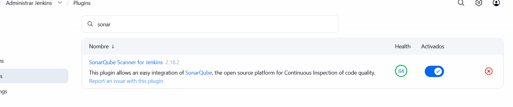

### Credencial del token SonarQube

`Manage Jenkins → Credentials → Global → Add Credentials`
- Kind: `Secret text` | ID: `sonar-token` | Secret: token generado en SonarQube

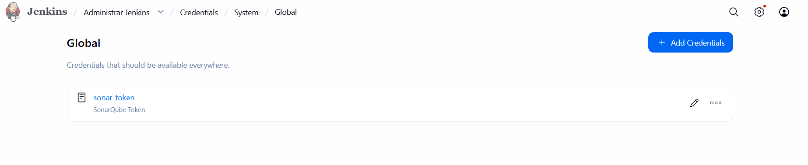

### Servidor SonarQube

`Manage Jenkins → System → SonarQube servers`
- Name: `SonarQube` | URL: `http://sonarqube:9000` | Token: `sonar-token`

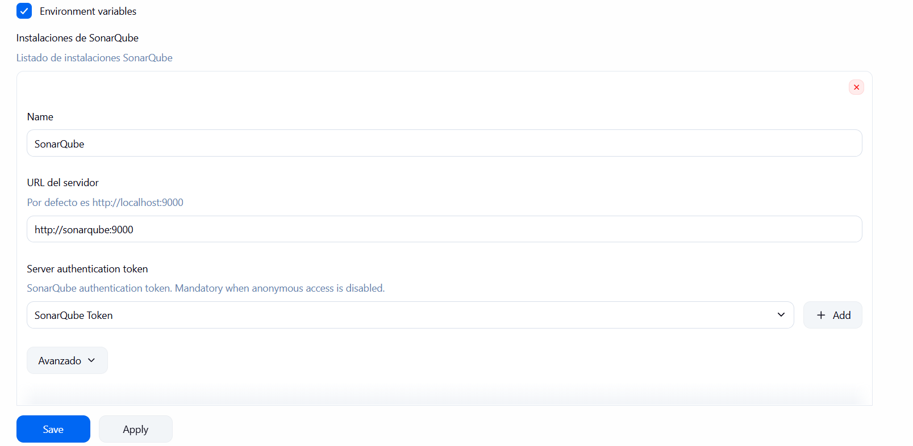

### Pipeline — Script from SCM

`New Item → Pipeline → Pipeline script from SCM`
- SCM: Git | URL: `https://github.com/JuanAmor8/cicd-demo.git` | Branch: `*/master`


***

## 3. Configuración de SonarQube

Acceso en `http://localhost:9000` (admin / admin1234).  
Proyecto creado manualmente con Project Key: `mi-app`.

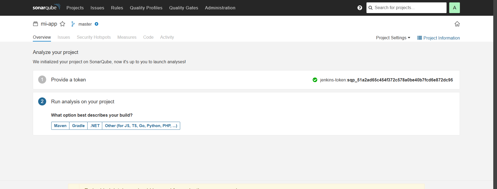

***

## 4. Flujo del Pipeline

```
Checkout → Build & Test → Static Analysis → Quality Gate → Trivy Scan → Deploy
```

| Etapa | Herramienta | Descripción |
|-------|-------------|-------------|
| Checkout | Git | Obtiene código desde GitHub (branch master) |
| Build & Test | Maven | `mvn clean package` — compila y ejecuta pruebas unitarias con JaCoCo |
| Static Analysis | SonarQube | Análisis estático de calidad y seguridad del código |
| Quality Gate | SonarQube | Aborta el pipeline si el análisis no es OK |
| Container Security Scan | Trivy | Escanea imagen Docker — aborta si hay CVEs CRITICAL |
| Deploy | Docker | Ejecuta el contenedor en `localhost:80` |

***

## 5. Puertas de Calidad (Gatekeeping)

El pipeline **bloquea el despliegue automáticamente** ante dos condiciones:

**1. SonarQube Quality Gate** — si el análisis falla, el pipeline aborta:
```groovy
waitForQualityGate abortPipeline: true
```

**2. Trivy — vulnerabilidades CRITICAL** — si encuentra al menos 1, retorna exit code 1:
```bash
trivy image --severity CRITICAL --exit-code 1 mi-app:latest
```

***

## 6. Evidencia de Fallo por Vulnerabilidades CRITICAL

El proyecto original usaba **Spring Boot 2.1.1.RELEASE** (2018), que incluye dependencias con múltiples CVEs CRITICAL en:

| Librería | Versión Vulnerable | CVEs |
|----------|--------------------|------|
| `jackson-databind` | 2.9.7 | CVE-2018-19360, CVE-2019-14379, CVE-2020-8840 (20+) |
| `tomcat-embed-core` | 9.0.13 | CVE-2019-0232, CVE-2024-50379 (8+) |

Trivy detectó estas vulnerabilidades, retornó `exit code 1` y bloqueó el despliegue.  
La etapa **Deploy fue omitida** — la aplicación nunca se desplegó en esta ejecución.

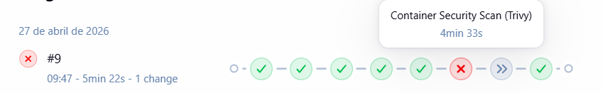

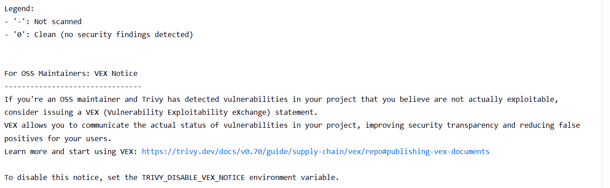

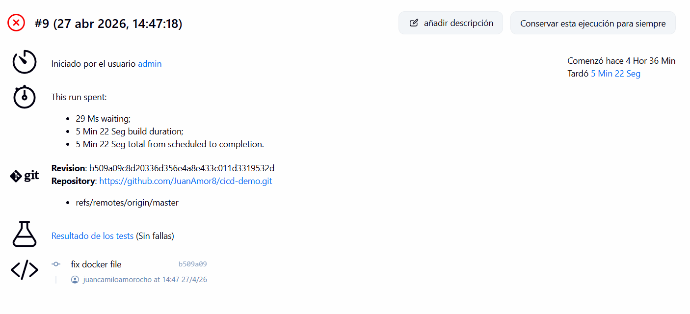

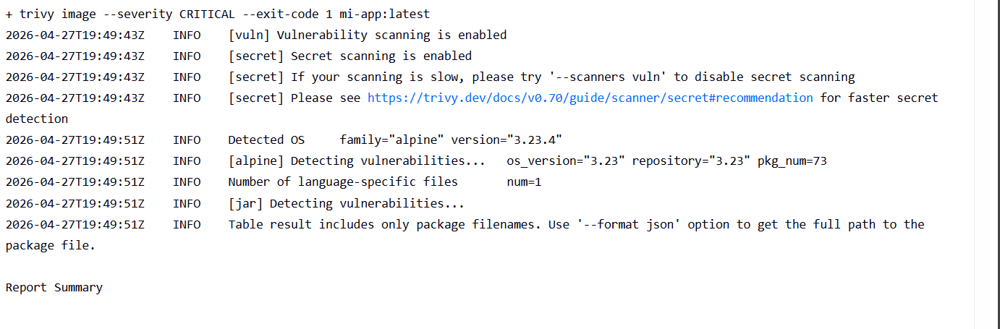

***

## 7. Corrección Aplicada

Se actualizó `pom.xml` a `spring-boot-starter-parent 2.7.18`, que actualiza automáticamente jackson-databind, Tomcat y Snakeyaml a versiones sin CVEs CRITICAL.

```xml
<parent>
    <groupId>org.springframework.boot</groupId>
    <artifactId>spring-boot-starter-parent</artifactId>
    <version>2.7.18</version>
</parent>
```


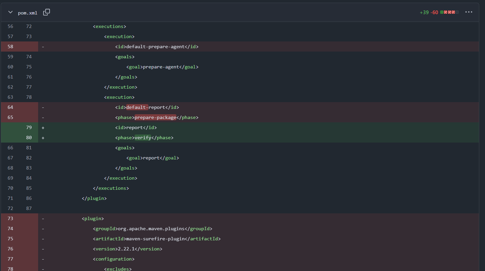

***

## 8. Ejecución Exitosa

Tras el fix, el pipeline completó todas las etapas sin errores y la aplicación fue desplegada.

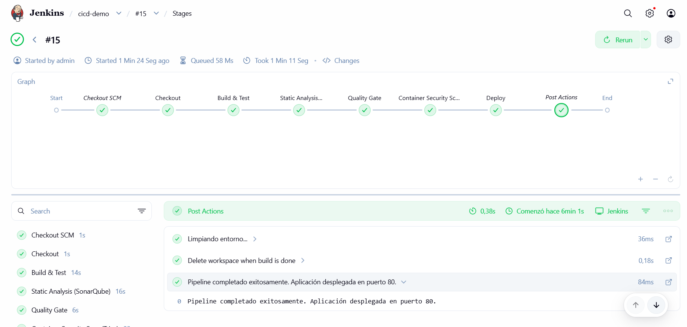

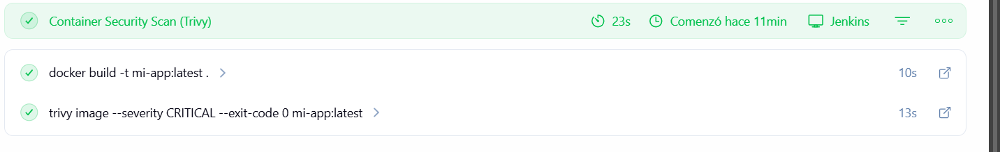

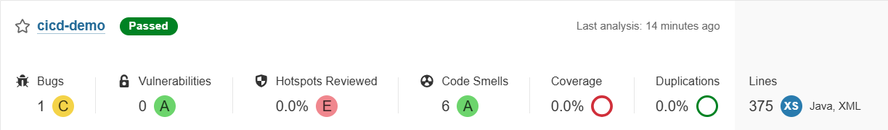

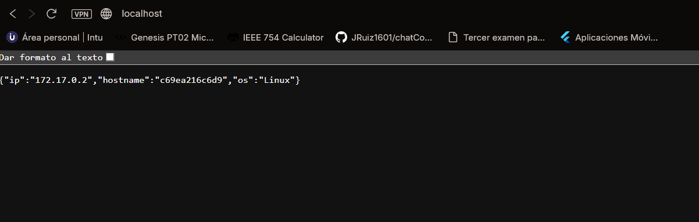

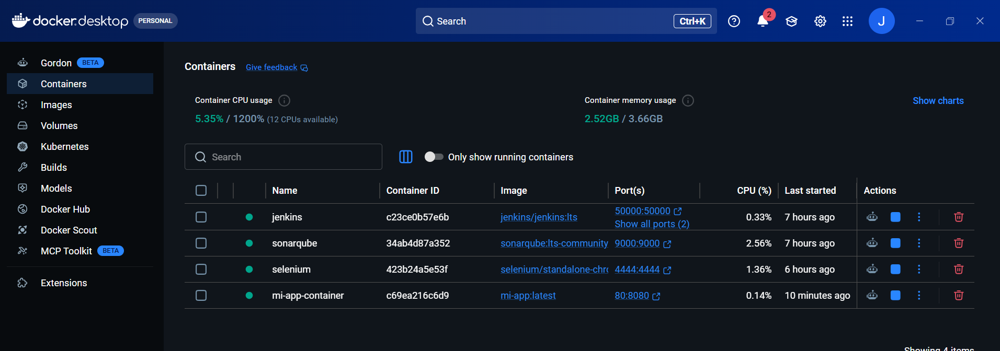
***

## 9. Prueba Final — Cambio de Código Detectado Automáticamente

Se introdujo deuda técnica en el código fuente y se hizo push para demostrar el ciclo completo de detección automática:


Jenkins detectó el nuevo commit y ejecutó el pipeline automáticamente.

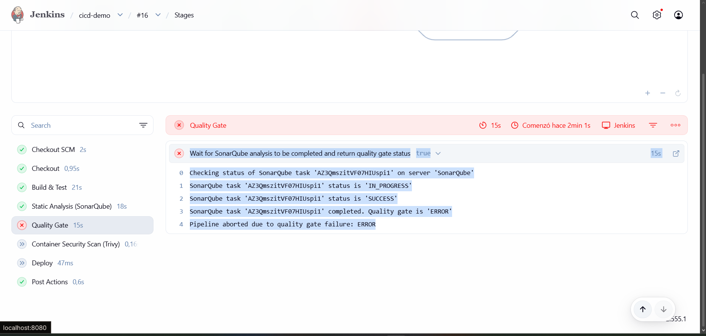


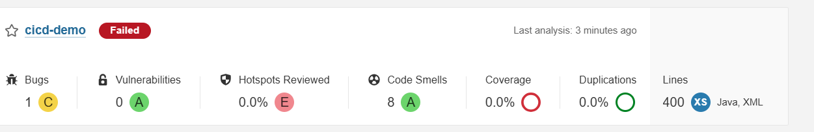
***

## 10. Bloque post — Limpieza

```groovy
post {
    always  { cleanWs() }
    failure { echo 'Pipeline fallido. Revisar logs.' }
    success { echo 'Aplicación desplegada en puerto 80.' }
}
```

`cleanWs()` se ejecuta siempre, garantizando que cada build parta de un workspace limpio.

## Codigo funcionando correctamente otra vez despues de la limpieza del bug con intencion
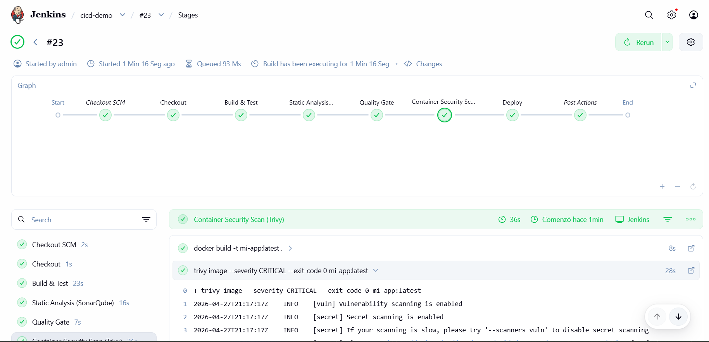
***

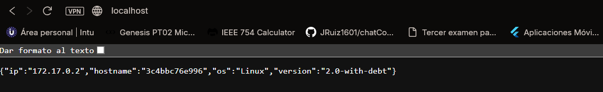

